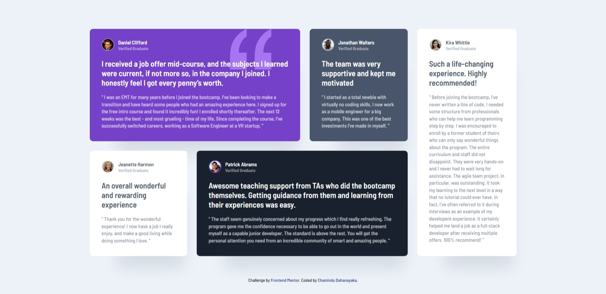

# Frontend Mentor - Testimonials grid section solution

This is a solution to the [Testimonials grid section challenge on Frontend Mentor](https://www.frontendmentor.io/challenges/testimonials-grid-section-Nnw6J7Un7). Frontend Mentor challenges help you improve your coding skills by building realistic projects. 

## Table of contents

- [Overview](#overview)
  - [The challenge](#the-challenge)
  - [Screenshot](#screenshot)
  - [Links](#links)
- [My process](#my-process)
  - [Built with](#built-with)
  - [What I learned](#what-i-learned)
  - [Continued development](#continued-development)
- [Author](#author)

## Overview

### The challenge

Users should be able to:

- View the optimal layout for the site depending on their device's screen size

### Screenshot



### Links

- Solution URL: [Solution URL here](https://www.frontendmentor.io/solutions/responsive-testimonials-grid-section-mobilefirst-workflow-reQgZZrySy)
- Live Site URL: [Live site URL here](https://chamindud.github.io/testimonials-grid-section/)

## My process

### Built with

- Semantic HTML5 markup
- Flexbox
- CSS Grid
- Mobile-first workflow

### What I learned

In this project, I learned to use below code snippets:

```css
section{
  box-shadow: 30px 70px 36px -40px hsla(217, 30%, 14%, 0.1);
}
#section-1{
  background-position: 90% 0%;
}
main{
  grid-template-areas: 'topL topL topL topL topM right' 'bottomL bottomM bottomM bottomM bottomM right';
}
```

### Continued development

I'm looking to improve my CSS knowledge to design more unique and new stuff.

## Author

- Frontend Mentor - [@ChaminduD](https://www.frontendmentor.io/profile/ChaminduD)
- LinkedIn - [Chamindu Dahanayaka](https://www.linkedin.com/in/chamindudahanayaka/)